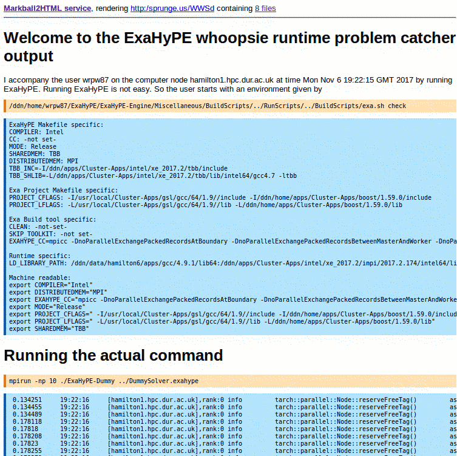
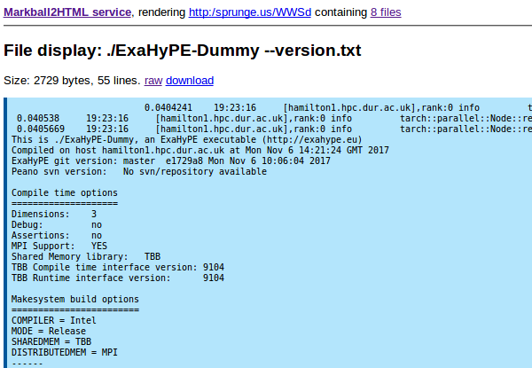

# A Markball render service in PHP

This directory contains an exemplary viewer for markball
files. It is inspired by the 
[Julia Notebook viewer](https://nbviewer.jupyter.org/)
which allows the user to enter a URL and subsequently
download and render the file to HTML.

The code is a bit ugly but includes a smallish Markball
class (which demonstrates the simpilicty of a parser)
and some view logic. The actual view logic is not that
well written, but it does it's job.

## Screenshots

Overview after reading in a file:

List a single file:

